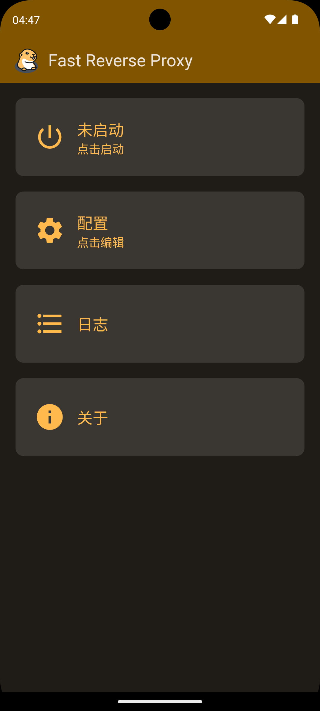
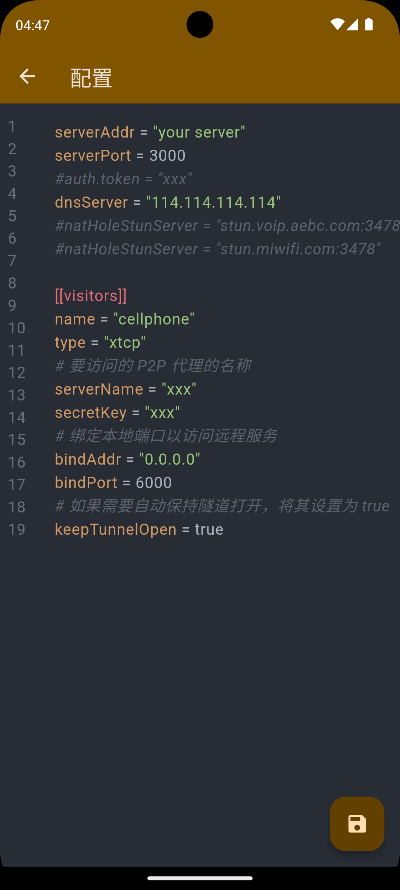
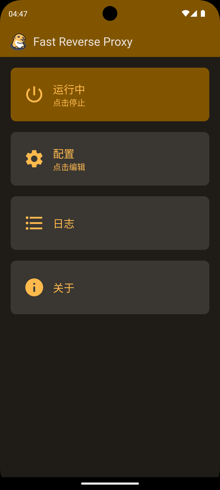

# FRP For Android

Fast Reverse Proxy For Android

## 构建APK

### 方法1：使用GitHub Actions（推荐）

1. Fork这个项目到您的GitHub账户
2. 在您的仓库中，进入 `Actions` 标签页
3. 选择 `Build APK` 工作流
4. 点击 `Run workflow` 按钮
5. 等待构建完成后，在 `Artifacts` 中下载生成的APK文件

构建将生成两个版本：
- `debug-apk`: 调试版本APK
- `release-apk`: 发布版本APK（未签名）

### 方法2：本地构建

如果您有Flutter开发环境，可以本地构建：

#### 使用构建脚本（推荐）

**Windows:**
```cmd
build.bat
```

**Linux/macOS:**
```bash
./build.sh
```

#### 手动构建

```bash
# 获取依赖
flutter pub get

# 构建调试版本
flutter build apk --debug

# 构建发布版本
flutter build apk --release
```

构建完成后，APK文件位于：
- Debug版本: `build/app/outputs/flutter-apk/app-debug.apk`
- Release版本: `build/app/outputs/flutter-apk/app-release.apk`

### 方法3：创建GitHub Release

如果您想创建正式发布版本：

1. 在您的仓库中创建一个新的tag：
   ```bash
   git tag v1.0.0
   git push origin v1.0.0
   ```

2. 或者在GitHub网页上手动触发Release工作流

这将自动构建APK并创建GitHub Release，包含下载链接和说明文档。

## Usage

✨先编辑配置并保存，然后点击启动。软件不会检测配置是否正确，请自行保证配置正确。配置请参考[frp](https://github.com/fatedier/frp)。
❗请不要做日志相关配置，会导致软件无法检测到frpc输出的日志



